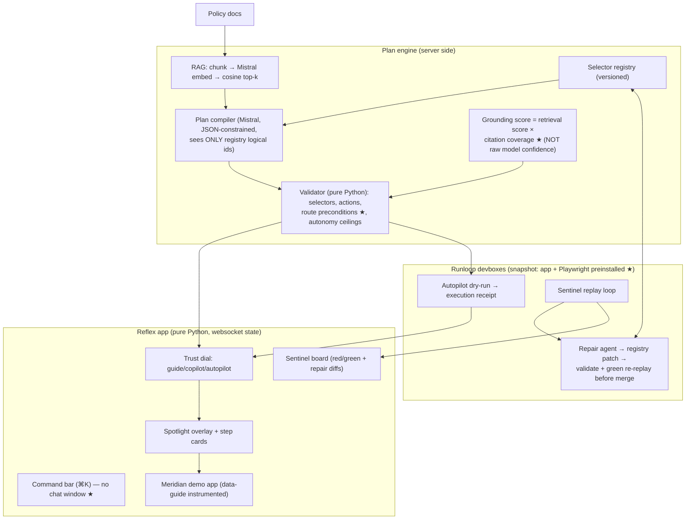

# 🏆 KERBEROS — ELITE PRODUCT EVALUATION REPORT

**Prepared for the project owner. Implementation is gated on this report's Final Decision (§13).**

**Method note.** Evaluated with the official gstack (garrytan/gstack, cloned and installed via `./setup`, runtime verified — `SKILL_START_PROTO: 1`). The methodologies applied and their sources:

| Review | gstack workflow used | Why |
|---|---|---|
| 1. Product reframe | `/office-hours` — Builder-mode brainstorm + Phase 3 Premise Challenge + Phase 4 Alternatives discipline | Exact match for hackathon-mode product interrogation |
| 2. Strategy | `/plan-ceo-review` — HOLD SCOPE posture, Prime Directives, CEO cognitive patterns (inversion reflex, focus-as-subtraction, proxy skepticism) | Exact match |
| 3. Engineering | `/plan-eng-review` — hostile plan review: shadow paths, "boring by default"/innovation tokens, blast-radius instinct | Exact match |
| 4–5. Design/UX | `/plan-design-review` + `/design-consultation` principles — Three Laws of Usability, billboard design, AI-slop elimination, design-for-trust | Plan-stage design review (no live site yet, so `/design-review`'s browser audit doesn't apply) |
| 6–8. Demo, red team, pruning | Structured per this phase's spec, argued with the same gstack lenses | No single skill covers these; closest-equivalent rule applied |
| 9. Retro | `/retro`'s decision-record discipline (its git-metrics steps don't apply to a pre-code repo) | Closest equivalent |

The gstack skills are interactive by design (AskUserQuestion gates at every decision). Per your instructions this evaluation ran autonomously and terminates in a decision gate **you** answer — so every decision the skills would have asked mid-flight is surfaced in this report instead, with the recommendation and reasoning that the AskUserQuestion brief would have carried. Nothing was silently decided that changes product scope; changes are listed in §8 as proposals adopted into the spec, reversible by you at the gate.

**Baseline snapshot (pre-review product):**
- **Thesis:** One guidance engine — a RAG-grounded, server-validated step plan over an approved DOM selector registry — projected at four trust levels: Guide (visual walkthrough), Copilot (confirm-each-step), Autopilot (sandbox dry-run then execute), Sentinel (continuous sandbox replay + self-healing when the UI drifts).
- **Target user:** operators of complex line-of-business software (claims processors, support/ops teams) and the teams who train, support, and automate for them.
- **Core problem:** tutorials, in-app support, UI automation, and UI regression tests are four expensive artifacts that all go stale the moment the interface changes; they are secretly one artifact.
- **Existing foundations (treated as infrastructure, not features):** DOM-aware guidance (approved `data-guide` selectors, server-side validation, visual pointing) and knowledge-base RAG (chunk→embed→cosine retrieve, OCR/doc confidence, retrieval scoring, model confidence, escalation).

---

## 1. EXECUTIVE VERDICT

| Category | Score |
| --- | --- |
| Innovation | **8/10** |
| Technical Depth | **8/10** |
| Visual Wow Factor | **8/10** |
| Real-World Value | **7/10** |
| Product Differentiation | **8/10** |
| Judge Memorability | **9/10** |
| Demo Potential | **9/10** |
| Hackathon Winning Potential | **8/10** |

### 🟡 **YELLOW LIGHT — FIX CRITICAL ISSUES FIRST**

The concept is strong enough to win and survived the red team with zero fatal-and-unfixable findings. But four issues found in this evaluation must be resolved *in the plan and in the first hours of the build* — not discovered on demo day. All four have concrete fixes (§11). If you accept the four conditions in §13, this converts to a green light without further review.

---

## 2. FINAL PRODUCT CONCEPT

### One sentence
**Kerberos turns tutorials, in-app support, automation, and UI testing — four products every software team builds and re-builds — into one AI-compiled, safety-validated plan, delivered at whatever level of trust the user dials in, and self-healing when the UI changes.**

### One paragraph
Kerberos compiles a user's goal ("issue a refund for claim #4821") into a **Guide Plan**: a sequence of steps grounded in the company's policy docs via RAG, expressed only in terms of an approved selector registry, and validated server-side before anything renders. That one artifact is then *projected* at the trust level the user chooses on a dial: **Guide** renders it as a spotlight walkthrough with citations; **Copilot** executes it step-by-step with human confirmation, and forcibly drops to confirmation on any step whose grounding is weak; **Autopilot** rehearses the whole plan in a disposable Runloop cloud sandbox, shows an execution receipt, then performs it live. A fourth headless head, **Sentinel**, replays every plan continuously in sandboxes; when the UI drifts and a replay goes red, a repair agent patches the selector registry, re-validates, and re-replays until green — so the guides, the automations, and the tests fix themselves overnight. The LLM is never trusted alone: the registry bounds where it acts, the validator bounds what it does, grounding bounds how autonomously, and the sandbox bounds where side effects land first.

### 30-second hackathon pitch
"Every software company builds the same four things: tutorials nobody reads, support docs that go stale, brittle automations, and UI tests that break every sprint. Four teams, four vendors — for what is secretly one artifact: a validated sequence of steps against a real interface. Kerberos builds that artifact once, from your policy docs, and projects it at four levels of trust — teach me, help me, do it for me, and watch it while I sleep. Turn the dial and the same plan that was a tutorial becomes an automation. And when your UI changes overnight, Kerberos notices in a sandbox, repairs its own selectors, and re-verifies — before a single user hits a broken guide. Pick any button in our app, rename it yourself, and watch the system heal."

---

## 3. WHY THIS PROJECT CAN WIN

- **It's differentiated by its artifact, not its model calls.** RAG chatbots produce prose. Kerberos produces a *compiled, validated, executable plan* — an artifact that can be rendered, co-driven, executed, replayed, and regression-tested. No prompt-wrapper project has an artifact like that.
- **Judges will remember two images:** the dial turning a tutorial into an autonomous execution, and a judge-chosen sabotage healing itself on stage. Both are mechanisms shown, not claims made.
- **It is not a chatbot, and can prove it in one sentence:** a chatbot cannot *know its answer still works*. Every Kerberos answer is continuously re-executed in a sandbox — answers with CI. There is no chat window anywhere in the product; the input is a command bar, the output is the interface itself moving.
- **The technical architecture is the safety story, and it's legible in 30 seconds:** registry bounds *where* (the model physically cannot name an unregistered selector — hallucination becomes a compile error), validator bounds *what* (server-side, no LLM), grounding bounds *how autonomously* (per-step autonomy ceilings), Runloop bounds *where first* (sandbox rehearsal before live). Technical judges get four inspectable layers; non-technical judges get "it rehearsed in a sandbox before touching anything real."
- **Both sponsor technologies are load-bearing.** Reflex's websocket state model is *why* one state variable can re-project the entire surface and why the backend can move highlights in real time without injected JS. Runloop devboxes are *where* every rehearsal and every Sentinel replay runs. Remove either and a demo capability disappears — this is the opposite of buzzword integration.

---

## 4. FINAL FEATURE SET

*(Post-pruning — see §8. Four core features, one wow. Copilot survives as the confidence gate inside Feature 2, not as a headline mode.)*

### CORE FEATURE 1 — Grounded Guide Compiler
- **Purpose:** goal → RAG retrieval over policy docs → Mistral-compiled step plan expressed in registry logical ids → server-side validation → per-step grounding scores and autonomy ceilings.
- **User impact:** ask for an outcome, get a correct, cited, policy-aware path — not a paragraph to interpret. Below-threshold goals produce an honest escalation card, not a guess.
- **Judge impact:** the retrieval visualization (chunks + scores streaming in before steps appear) makes "grounded" visible instead of claimed; the policy-dependent plan (>$500 refunds require a reason code and memo) proves the AI read the docs, not the pixels.
- **Technical complexity:** Medium. The pipeline is proven infrastructure; the new work is the compile prompt, plan schema, and validator.
- **Demo importance:** Critical — every other feature consumes its output.

### CORE FEATURE 2 — The Trust Dial (confidence-gated autonomy)
- **Purpose:** one control — Guide / Copilot / Autopilot — that re-projects the same validated plan. Effective autonomy per step = `min(dial, step.autonomy_ceiling)`: users can dial up, but a weakly-grounded step still stops and asks.
- **User impact:** adoption path for real organizations — start at Guide, earn Autopilot with Sentinel evidence. Trust becomes a setting, not a leap.
- **Judge impact:** this is the thesis made physical. The forced-confirmation moment ("it knows what it doesn't know, per step") is the credibility beat technical judges score.
- **Technical complexity:** Low-Medium. One state var + three projection renderers (a `ModeRenderer` interface each — no conditional spaghetti) + the ceiling min().
- **Demo importance:** Critical — it is the multi-use-case toggle.

### CORE FEATURE 3 — Sandboxed Autopilot with Execution Receipt
- **Purpose:** before touching the live UI, the full plan runs via Playwright in a disposable Runloop devbox against a clone of the app; the user sees a receipt (per-step screenshots + final state diff) and confirms; then the live surface executes with a reasoning ticker.
- **User impact:** autonomous execution you can inspect *before* it happens — the inversion of every scary agent demo.
- **Judge impact:** "it rehearsed in a sandbox first" lands with everyone; the receipt is a visual no other team will have.
- **Technical complexity:** High — the riskiest integration (see §11 R1).
- **Demo importance:** Very high — the crowd-pleaser and the Runloop proof.

### CORE FEATURE 4 — Sentinel (continuous verification board)
- **Purpose:** every stored plan replays in fresh devboxes on demand/schedule; a red/green board shows which guides are *currently proven to work*. Failures capture the failed step + DOM snapshot and feed the repair agent (§5).
- **User impact:** documentation with a build status. Stale guides get caught by machines at night instead of by users at 9am.
- **Judge impact:** reframes the whole product from "demo" to "platform with a loop" — tutorials that are also tests.
- **Technical complexity:** Medium once Feature 3's devbox path exists (same replay machinery).
- **Demo importance:** High — it stages the wow.

### Retained support features
- **Escalation card** (low-grounding goal → partial plan + human handoff): cheap, and doubles as demo insurance — if the wow's repair fails on a pathological sabotage, "it knows it can't heal this, and files a report" is a *feature beat*, not a failure.
- **Instrumentation-diff slide**: the ~12-line `data-guide` diff that makes Meridian "any app," addressing the mock-app discount (§11 R2).

---

## 5. THE WOW FEATURE — Judge-Driven Sabotage, Self-Healing Repair

*(Upgraded during red team from a scripted env-flag sabotage to judge-driven — the single highest-leverage change in this evaluation.)*

### What the judge sees
The presenter says: **"Pick any button in this app. Rename it. Move it."** The judge types a new label — say *Approve Refund* becomes *Release Funds*, relocated to a different panel. The working guide is now broken *by the judge's own hand*. One click on "Run Sentinel": a red replay tile appears with the failed step; a repair diff appears (old selector entry → proposed patch, shown like a tiny PR); the patch re-validates and re-replays green in a sandbox picture-in-picture; the presenter re-runs the guide live — the spotlight lands on the judge's renamed button. Total: ~60 seconds.

### What happens
The UI drifted; the stored plan's step no longer resolves; Sentinel caught it in a sandbox; a repair agent diagnosed the drift from the DOM snapshot, patched the selector registry, and nothing shipped until the fix replayed green.

### What happens technically
Sabotage writes a runtime override (label/position for any registered control) into Meridian's control constants — no code edit, fully reversible. Sentinel's Playwright replay fails on the stale selector and captures the live DOM. The repair agent (Mistral) gets the failed step, the old registry entry, and the DOM snapshot, and must propose a patch that (a) passes the server-side validator and (b) goes green on a fresh-devbox re-replay before it merges as a new registry version with a diff trail. Matching is constrained to label/aria/role evidence in the snapshot — the agent cannot silently retarget to an arbitrary element.

### Why it is memorable
It closes a loop no one else will close on stage: **break → detect → repair → re-verify → prove**, on an input the presenter could not have staged. "Our documentation just fixed itself, and you're the one who broke it" is the sentence judges repeat to each other.

### Why competitors are unlikely to demonstrate something similar
It requires all four layers to already exist — registry, validator, sandbox replay, and repair — wired end-to-end. A chatbot team cannot bolt this on; there is nothing to replay. And teams that do build agent-executes-UI demos almost never build the verification loop, because it's only possible when guidance steps are a *validated artifact* rather than free-form model output.

---

## 6. MULTI-USE-CASE TOGGLE — FINAL MODES

Shared by all modes: the Guide Plan, the compiler, the registry, the validator, the grounding scores, and the Reflex state. Only the projection changes.

| | **Guide** | **Copilot** *(reworked — see below)* | **Autopilot** | **Sentinel** *(headless 4th head)* |
|---|---|---|---|---|
| Target user | New/occasional operator learning a flow | Everyday operator who wants speed with control | Power user / ops team that wants the outcome | Nobody — runs while everyone sleeps |
| Problem solved | Tutorials nobody reads; docs that don't point | "Faster than reading, safer than full auto" | Repetitive multi-step work | Silent staleness of guides/automations/tests |
| What changes | Spotlight overlay, step card with *why* + citation, advance on user's own action; teal instructional theme, docs panel visible | AI proposes, human confirms, AI executes; amber theme, action bar | Sandbox dry-run → receipt → live execution with reasoning ticker; violet cinematic theme, input frozen, page dimmed | No UI — red/green verification board + repair diffs |
| What stays shared | The identical validated plan object — verifiably the same `plan_id` on screen in every mode | same | same | replays the same plans verbatim |
| DOM behavior | Highlight only | Execute per-step after confirm, registry-bounded | Execute full plan, registry-bounded, sandbox-first | Playwright replay against clone; DOM snapshot on failure |
| RAG behavior | Citations rendered per step | Grounding gate: weak step ⇒ forced confirm | Grounding ceiling: weak step ⇒ cannot auto-run at all | Re-compile check when docs re-ingest |
| Best demo scenario | "Issue a refund for claim #4821" — plan visibly changes above the $500 policy threshold | Same goal — one step forces confirmation | Same goal — receipt, then live execution | Judge sabotage → self-heal (§5) |

**CEO-review verdicts:** 🟢 KEEP Guide · 🟡 REWORK Copilot — it stays a real dial position but is demoted from a headline demo beat to *the confidence gate made visible*; it gets ~15 seconds of demo, not a full act · 🟢 KEEP Autopilot · 🟢 KEEP Sentinel, reframed: not a user-selectable mode but the platform's fourth head that guards the other three (this also cleanly resolves "3–5 modes" — three on the dial, one behind it).

**Why the modes form ONE platform:** they are four projections of one plan object, driven by one state variable, sharing one safety pipeline. The demo proves it by showing the same plan id and the same steps in every mode — the toggle cannot be five apps behind tabs, because there is only one artifact to show.

---

## 7. TECHNICAL ARCHITECTURE

Full detail in [docs/ARCHITECTURE.md](docs/ARCHITECTURE.md). Deltas from this evaluation are marked ★.

- **Frontend:** Reflex. Mode = one state var; three `ModeRenderer` projections (isolation boundary — the eng review's anti-spaghetti rule). Spotlight overlay is server-state-driven; no injected JS.
- **Backend / orchestration:** the plan engine is importable without the UI (Sentinel and the dry-run runner reuse it headlessly inside devboxes).
- **DOM intelligence:** registry is the only home of CSS; planner sees logical ids only; ★ each step now carries a **route precondition** (`route: "/claims/4821"`) and the validator rejects impossible transitions — this closes the page-state-mismatch hole the eng review found.
- **RAG:** existing pipeline as designed; scores flow into steps.
- **Confidence system:** ★ renamed and re-based. "Model confidence" is not calibrated and technical judges know it; the shipping signal is **grounding = retrieval score × citation coverage** (fraction of the step's claim actually supported by retrieved text), which is computable and honest. Escalation below threshold. (Frustration/failed-loop signals: evaluated, rejected for hackathon scope — low impact per hour.)
- **Mode configuration:** shared plan/engine/state; configurable projections; isolated execution adapters (live-browser executor vs. sandbox Playwright executor — same plan, two adapters).
- **Validation:** server-side, no LLM, before render or execute; repair patches pass the same gate plus a green re-replay.
- **Failure handling:** every failure is a named, visible state (eng review's zero-silent-failures directive): compile failure → escalation card; validation failure → rejected-plan card naming the rule; live execution step failure → halt + rollback note + Sentinel ticket; devbox unreachable → labeled degraded mode (§10 contingencies); unhealable sabotage → escalation card with the repair agent's reasoning.

---

## 8. GSTACK FINDINGS

### Review 1 — /office-hours (product reframe)
**Three strongest aspects:** (1) toggle-as-autonomy-dial is a genuine reframe — a dimension of one task, not vertical tabs, provably one engine; (2) the wow closes a loop (break→detect→repair→verify), which reads as *platform*, not *demo*; (3) the safety architecture is legible enough to explain to a non-technical judge in one breath.
**Three biggest weaknesses:** (1) the whole demo runs on a self-built mock app — judges may discount ("you control both sides"); (2) the pitch risks sliding into "guided tours for enterprise software," a known category (WalkMe/Pendo) that judges may pattern-match to; (3) the original plan put the wow feature last in the build order (Tier 2.5) — the classic hackathon death.
**What would make judges forget it:** leading with the overlay/tutorial framing; a chat window anywhere on screen; the sabotage looking staged.
**What would make judges remember it:** the judge breaking it themselves and watching it heal; the dial as a physical object; "answers with CI."
**Single highest-leverage improvement:** make the sabotage judge-driven (adopted — §5), and invert the build order to spine-first (adopted — §12).
**Premise challenge (Phase 3):** Premise "the four artifacts are secretly one" — survives: it holds precisely when steps are *validated data* rather than prose, which is exactly what the registry+validator provide; this premise is the product. Premise "hackathon judges reward autonomy" — revised: they reward *bounded* autonomy; the gate moment is as important as the execution. Premise "Meridian must feel real" — upgraded from nice-to-have to condition (R2).

### Review 2 — /plan-ceo-review (HOLD SCOPE posture)
Thesis sharpened to the §2 one-liner. Differentiation answers: not-a-RAG-chatbot because the output is a validated executable artifact, not prose; not-an-agent-wrapper because the model is bounded by a registry it cannot escape and a validator it doesn't control; what a chatbot fundamentally cannot do: *prove its answer still works* (continuous sandbox replay). Toggle verdicts in §6 (Copilot reworked, Sentinel reframed). Strongest narrative: **the trust dial** — also the adoption story a founder-judge will ask about (orgs start at Guide, earn Autopilot with Sentinel evidence; autonomy ceilings are the enterprise answer to "who'd let an AI click Approve?"). Inversion reflex finding: the most likely way this fails on stage is integration risk concentrated in Runloop — spike it first (R1). Focus-as-subtraction: cut list in Review 8.
⚠️ One flag outside the original scope: the name **Kerberos** collides with the MIT authentication protocol every infra-literate judge knows. The three-headed-watchdog framing must land in the first ten seconds of the pitch (it does — §10), or rename before the hackathon. Repo name is fine either way.

### Review 3 — /plan-eng-review (hostile)
🔴 **Critical:** (1) **Runloop clone bootability** — the dry-run/Sentinel story requires Meridian + Playwright to run headlessly inside a devbox with seeded data and no external dependencies; if discovered broken late, Features 3–5 all collapse. Fix: snapshot-based devbox (app preinstalled), mock-planner mode inside the sandbox (no live API dependency), and a ≤2h hello-world spike before any other Tier work. (2) **Page-state mismatch** — a plan compiled for page A executed while the user is on page B; original schema had no defense. Fix (adopted): route preconditions per step + validator transition checks + executor navigates or halts. (3) **Live-execution race** — user input during Autopilot mutating state mid-plan. Fix: freeze input during execution (also better theater).
🟠 **Important:** (4) uncalibrated "model confidence" → replaced by citation-coverage grounding (adopted, §7). (5) **Heal-to-wrong-target** — a repair that goes green on the wrong element is worse than staying red. Fix: label/aria-constrained matching + patch shown as a human-readable diff + versioned registry with rollback. (6) On-stage Sentinel latency — pre-warmed devbox pool, plans ≤8 steps, target <60s for the full heal loop.
🟡 **Nice-to-have:** plan cache keyed on (goal, docs-version, registry-version); idempotent step execution; retrieval-quality eval script.
**Boring-by-default audit:** in-memory vector store (not a vector DB), JSON files for plans, no queue system — all correct; the two innovation tokens are spent on Runloop and the repair agent, which are the differentiators. RAG chunking: markdown-header-aware chunks, k=4, threshold tuned on the 3–4 demo docs — do not over-engineer past that.

### Reviews 4–5 — /plan-design-review + /design-consultation (design & UX)
**First-30-seconds test:** hook passes, but cold-open Autopilot needs a 5-second caption ("Meridian — a claims portal. The AI has never been given a script for this.") or judges won't know what they're watching. **The toggle** must be a *physical* segmented dial, not tabs: mode switch morphs theme + layout in <400ms (Guide teal/spacious with docs panel; Copilot amber with action bar; Autopilot violet/cinematic, page dimmed, input frozen) — the transformation must be felt peripherally. **Pointer experience:** spotlight cutout (dim everything except the target), animated beacon, step card with one *why* line + citation chip; the AI should feel like it's *operating* the page, not annotating it. **AI-slop elimination (aggressive):** no chat window anywhere — a ⌘K command bar is the only input (this single decision kills "generic chatbot" on sight); no dashboard, no decorative metric cards; Sentinel board is plan tiles + status + repair diffs, nothing else; receipt is filmstrip + one state diff, not a JSON dump.
**Impact × cost ranking:** 1. command bar (high/low) · 2. mode theming+morph (high/low) · 3. spotlight overlay (high/medium) · 4. repair-diff "tiny PR" rendering (high/low) · 5. execution receipt filmstrip (med/med) · 6. reasoning ticker (med/low) · 7. animated dial skeuomorphism (low/med — cut if tight).
**Visual direction:** dark UI base with per-mode accent; typography-led (one display face for mode names, mono for plan steps); loading = streaming retrieval chunks (never spinners); success = the plan tile flipping green; failure = red tile with the named rule that caught it. Premium comes from restraint + motion discipline, not gradients.

### Review 6 — Demo killer
**Failure points & mitigations:** Mistral latency (pre-warmed plan cache; compile live only in Guide where "thinking" reads well) · Runloop/network (pre-warmed devboxes + pre-recorded receipt clip as labeled fallback — honesty preserves credibility) · stage wifi (run app locally; Runloop is the only remote dependency) · judge picks an unhealable sabotage, e.g. deletes the control (escalation card turns it into the "it knows what it can't do" beat — rehearsed path, §4).
**Dead air:** compile wait → stream chunks/steps; replay wait → devbox picture-in-picture.
**Generic moments purged:** no typed chat (command bar), no JSON on screen until the 30-second tech reveal, no feature tour — every second is the one scenario at different trust levels.
**Confusion points:** "devbox" → say "disposable cloud sandbox"; four-layer safety → one diagram, one breath each; don't explain Reflex/Mistral plumbing unless asked.

### Review 7 — Red team (five critics)
| Critic | Strongest attack | Class | Fix |
|---|---|---|---|
| Hackathon judge | "It's WalkMe with an LLM." | 🟠 Serious | Name the contrast on stage: tour tools are hand-authored, can't read policy, can't execute, can't self-heal; Kerberos compiles from docs, executes, and repairs. One sentence, delivered before they think it. |
| Startup founder | "No enterprise lets an AI click *Approve refund*." | 🟠 Serious | The dial *is* the answer: orgs adopt at Guide, per-step autonomy ceilings + Sentinel evidence earn escalation. Say it as the GTM line in the close. |
| Principal AI engineer | "Self-heal on your own toy app is just a selector remap — trivially stageable." | 🟠 Serious | Judge-driven sabotage (§5) makes it unstageable; the repair shows its evidence (label/aria matching), passes the validator, and must re-replay green. Also show the escalation path exists for unhealable breaks. |
| Elite product designer | "Three sequential mode demos of the same task = repetitive by act three." | 🟡 Moderate | Copilot compressed to the 15-second gate moment; Autopilot opens the show cold, so the dial section only has two full acts. |
| Skeptical end user | "I don't want a tour, I want my refund done." | ⚪ Cosmetic | That *is* Autopilot, and it's the first thing shown. |
| (cross-cutting) | "Everything runs on an app you built — you control both sides." | 🔴 Fatal if unaddressed | Instrumentation-diff slide (~12 lines of `data-guide` attributes = the entire integration surface) + honest framing ("any app that can add 12 data attributes gets all four heads") + stretch second app if Phase E finishes early. Cannot be fully eliminated in a weekend; can be defused. |

### Review 8 — Feature pruning (Value = Demo Impact × Differentiation × Feasibility, each /5)
| Feature | I×D×F | Verdict |
|---|---|---|
| Guide compiler + spotlight Guide mode | 5×4×4 = 80 | 🟢 KEEP |
| Trust dial + grounding gate | 5×5×4 = 100 | 🟢 KEEP |
| Sandboxed Autopilot + receipt | 5×5×3 = 75 | 🟢 KEEP |
| Sentinel board + replay | 4×5×3 = 60 | 🟢 KEEP |
| Judge-driven self-heal (WOW) | 5×5×3 = 75 | 🟢 KEEP — the demo's spine |
| Copilot as separate headline mode | 2×2×5 = 20 | 🟡 REWORKED into the gate moment |
| Escalation card | 3×3×5 = 45 | 🟢 KEEP (cheap + demo insurance) |
| Second target app | 4×4×1 = 16 | 🟡 KEEP IF TIME (Phase E only) |
| Guide analytics / success-rate dashboard | 1×2×4 = 8 | 🔴 CUT (one stat on the Sentinel board survives) |
| Voice-triggered goals | 2×1×4 = 8 | 🔴 CUT |
| Frustration-detection signals | 1×2×2 = 4 | 🔴 CUT |

### Review 9 — Retrospective
**Assumptions that changed:** Copilot is a gate, not an act · confidence must be computable (grounding), not vibes · the sabotage must be adversarial to be believed · the wow must be built *first* as a thin spine, not last as a reward.
**Ideas eliminated:** voice input, analytics dashboard, frustration signals, scripted-only sabotage, chat window (was implicit in "AI product"; killed by design review).
**Weaknesses discovered:** Runloop bootability as single point of collapse; page-state mismatch hole in the plan schema; heal-to-wrong-target; Kerberos name collision; mock-app discount as the only near-fatal.
**Highest-leverage changes:** judge-driven sabotage; spine-first build order; command-bar-not-chat; route preconditions.
**Final direction:** unchanged in essence, materially hardened — same product, one fewer headline mode, honest confidence, adversarial wow, and a build order that guarantees the wow exists by mid-hackathon.

---

## 9. FINAL UX DIRECTION

- **Overall interface:** dark, typography-led, one screen — Meridian occupies the full canvas; Kerberos manifests as a slim top bar (dial + plan id + mode badge) and the ⌘K command bar. Kerberos should feel like a *layer over software*, not a website. No chat window exists in the product.
- **Toggle behavior:** physical segmented dial, top center. Switching cross-fades theme accent (teal → amber → violet), morphs layout (docs panel in Guide; action bar in Copilot; dimmed frozen canvas in Autopilot) in <400ms, and visibly keeps the same plan id — the proof-of-one-engine detail.
- **DOM pointer experience:** spotlight cutout with dimmed surround, soft animated beacon on the target, step card anchored to it with the *why* line and a citation chip; advancing feels like the page is being *operated*, not annotated.
- **AI interaction:** command bar with goal autocomplete; compile renders as streaming retrieval chunks (score-tagged) resolving into plan steps; no spinners anywhere.
- **WOW visuals:** sabotage panel (judge types the new label) → Sentinel tile flips red → repair diff rendered like a two-line PR with evidence chips → picture-in-picture sandbox re-replay → tile flips green → live re-run lands the spotlight on the judge's renamed button.
- **Motion discipline:** one easing curve, 200–400ms everywhere, motion only on state change — never decorative.

## 10. FINAL DEMO SCRIPT (4:00)

| Time | Screen / action | Narration | Expected judge reaction |
|---|---|---|---|
| 0:00–0:05 | Meridian full-screen, caption: "Meridian — a claims portal. No script exists for what you're about to see." | (silent beat) | Oriented in one line |
| 0:05–0:20 | ⌘K → "Issue a refund for claim #4821." Dial already at **Autopilot**. Receipt flashes, then cursor moves, fields fill, reasoning ticker narrates. Refund done. | "No macro. No script. And I'll show you why that was actually safe." | "Wait — it just did it?" |
| 0:20–0:45 | Slide: four artifacts (tutorials/support/automation/QA) collapsing into one plan object. | "Every company builds these four things, and all four die the day the UI changes. They're secretly one artifact. We build it once." | Problem lands, thesis lands |
| 0:45–1:30 | Dial → **Guide**. Same goal. Retrieval chunks stream, steps compile, spotlight walks the flow, citation chips visible. Point at the reason-code step. | "Same brain, zero autonomy. And notice — the plan is different because this refund is over $500. It read the *policy*, not the pixels." | RAG is visible, not claimed |
| 1:30–1:45 | Dial → **Copilot**. One weakly-grounded step forces a confirm. | "Per-step honesty: it knows what it doesn't know, and won't act there without you." | Technical judges check the safety box |
| 1:45–2:15 | Dial → **Autopilot** again — now show what the cold open skipped: the Runloop receipt (filmstrip + state diff) from the sandbox rehearsal. | "Before it touched anything real, it already did the whole thing in a disposable cloud sandbox. This is the receipt." | "Oh, *that's* why it was safe" |
| 2:15–3:15 | **WOW.** Hand the judge the sabotage panel: "Rename any button. Move it." They do. Run the guide — it breaks. Click Sentinel: red tile → repair diff with evidence → sandbox re-replay green (PiP) → live re-run lands on *their* renamed button. | "You broke it. Nobody filed a ticket. Our documentation just fixed itself — and it re-verified in a sandbox before it trusted its own fix." | The moment they retell later |
| 3:15–3:45 | One diagram, four layers. | "The model is trusted with nothing alone: a selector registry it can't escape — hallucination is a compile error; a server-side validator; grounding scores that cap autonomy per step; and every execution rehearses in a Runloop sandbox first. The whole UI is pure-Python Reflex — the dial is literally one state variable, which is why all four modes are provably one engine." | Technical credibility sealed |
| 3:45–4:00 | Dial spins slowly through modes. | "Tutorials, support, automation, and QA were never four products — they're one plan at four levels of trust. Kerberos: three heads, one body. And instrumenting *your* app is twelve data attributes." | Vision + feasibility close |

**Contingencies:** Runloop unreachable → labeled pre-recorded receipt/replay clips, everything else live. Unhealable sabotage (control deleted) → escalation card beat: "and when it *can't* heal safely, it says so and files the report — that honesty is the product." Model stall → plan cache warm; compile live only in Guide.

## 11. RISKS BEFORE IMPLEMENTATION

🔴 **Critical**
- **R1 — Runloop clone bootability** (Features 3–5 collapse if false). *Mitigation:* first 2 hours of the build = spike: devbox snapshot boots Meridian + Playwright headless with seeded data and a mock-planner mode; hard go/no-go checkpoint — on failure, fall back to a local headless-Chromium "sandbox" and say so honestly in the tech reveal (loses sponsor points, keeps the loop).
- **R2 — Mock-app credibility discount** ("you control both sides"). *Mitigation:* judge-driven sabotage + instrumentation-diff slide + closing line pricing integration at 12 data attributes; second app only if Phase E finishes early.
- **R3 — Wow built last and never lands.** *Mitigation:* §12 build order is spine-first — an ugly end-to-end break→heal loop must exist by the midpoint (D2 gate) before any polish is bought.

🟠 **Important**
- **R4 — Heal-to-wrong-target** (green but wrong is worse than red): label/aria-constrained matching, human-readable patch diff, versioned registry rollback.
- **R5 — On-stage latency** (compile + replay): plan cache, pre-warmed devbox pool, ≤8-step plans, full heal loop rehearsed under 60s.
- **R6 — Live-execution race with user input:** freeze input during Autopilot (also stagecraft).

🟡 **Minor**
- **R7 —** Kerberos/auth-protocol name collision (framing fixes it; rename is a 10-minute decision if it bothers anyone).
- **R8 —** Reflex styling drifting into generic-SaaS look (design direction in §9 is specific enough to prevent it).
- **R9 —** Demo wifi (app runs locally; Runloop is the only remote leg and has a fallback).

## 12. FINAL MVP BUILD PLAN

*(Supersedes docs/ROADMAP.md's tier order. Two builders assumed; times are focused-hours. Priority P0 = demo dies without it.)*

**PHASE A — FOUNDATION & SPIKE (~5h)**
| Task | Pri | Diff | Deps | Est | Demo impact |
|---|---|---|---|---|---|
| A1 Runloop spike: devbox snapshot boots app+Playwright, go/no-go | P0 | High | — | 2h | Gates everything (R1) |
| A2 Meridian core: claims list/detail/refund flow, 12 instrumented controls, seeded data | P0 | Med | — | 3h | The stage |

**PHASE B — CORE EXPERIENCE (~9h)**
| Task | Pri | Diff | Deps | Est | Demo impact |
|---|---|---|---|---|---|
| B1 RAG over 3–4 policy docs, scores exposed | P0 | Med | — | 2.5h | Grounding beat |
| B2 Plan compiler + schema (routes, grounding, ceilings) | P0 | Med | B1 | 2.5h | Everything |
| B3 Validator (selectors, actions, routes, ceilings) | P0 | Low | B2 | 1h | Safety story |
| B4 Guide mode: spotlight, step cards, citations | P0 | Med | B2 | 3h | First visual proof |

**PHASE C — WOW SPINE, UGLY-BUT-REAL (~8h) — must be demo-able by the hackathon midpoint**
| Task | Pri | Diff | Deps | Est | Demo impact |
|---|---|---|---|---|---|
| C1 Sandbox executor: plan → Playwright in devbox → pass/fail + DOM snapshot | P0 | High | A1,B3 | 3h | Sentinel + receipt engine |
| C2 Sabotage panel (judge-driven rename/move override) | P0 | Low | A2 | 1h | The wow's trigger |
| C3 Repair agent: snapshot → constrained patch → validate → green re-replay → versioned merge | P0 | High | C1 | 3h | THE wow |
| C4 Minimal Sentinel board (tiles + repair diff) | P0 | Low | C1 | 1h | Stages the wow |

**PHASE D — FULL DIAL (~6h)**
| Task | Pri | Diff | Deps | Est | Demo impact |
|---|---|---|---|---|---|
| D1 Live executor + input freeze + reasoning ticker | P0 | Med | B3 | 2.5h | Cold open |
| D2 Execution receipt (filmstrip + state diff) | P1 | Med | C1 | 2h | "That's why it's safe" |
| D3 Copilot gate moment (forced confirm on weak step) | P1 | Low | D1 | 1h | Credibility beat |
| D4 Escalation card | P1 | Low | B2 | 0.5h | Demo insurance |

**PHASE E — POLISH & DEMO HARDENING (~7h)**
| Task | Pri | Diff | Deps | Est | Demo impact |
|---|---|---|---|---|---|
| E1 Mode theming + <400ms morph + dial styling + command bar | P1 | Med | D | 3h | Transformation feel |
| E2 Plan cache + devbox pre-warm + latency rehearsal (<60s heal) | P0 | Med | C | 1.5h | Dead-air killer |
| E3 Full run-throughs incl. unhealable-sabotage path + fallback clips | P0 | Low | all | 2h | R3/R5 insurance |
| E4 Instrumentation-diff slide + 4-layer diagram | P1 | Low | — | 0.5h | R2 defusal |
| (E5 Second tiny app — only if E1–E4 done) | P2 | Med | all | 3h | Portability proof |

Total P0/P1: ~35h ≈ 17–18h per builder across a weekend — tight but honest, with the wow secured by Phase C's midpoint gate rather than gambled on the final night.

## 13. FINAL DECISION GATE

### 🟡 CONDITIONAL GREEN LIGHT

The concept is differentiated, feasible, and strategically strong — provided four conditions, all already folded into the plan above, are treated as binding:

1. **Runloop spike first (R1):** the ≤2h devbox go/no-go happens before any other build work; the fallback path is pre-decided, not improvised.
2. **The sabotage is judge-driven (R2/§5):** the scripted-only version is not an acceptable substitute; it converts the wow from "staged" to "unfakeable."
3. **Spine-first build order (R3/§12):** an end-to-end break→detect→repair→verify loop exists, however ugly, by the hackathon midpoint — polish is only purchased after.
4. **Honest confidence (§7):** grounding = retrieval × citation coverage; the phrase "model confidence" does not appear in the demo.

Accept these four and this is a green light: begin building the demo-ready MVP per §12. Reject any of them and we should talk before code is written.

**Awaiting the project owner's explicit green light. No implementation has begun.**
