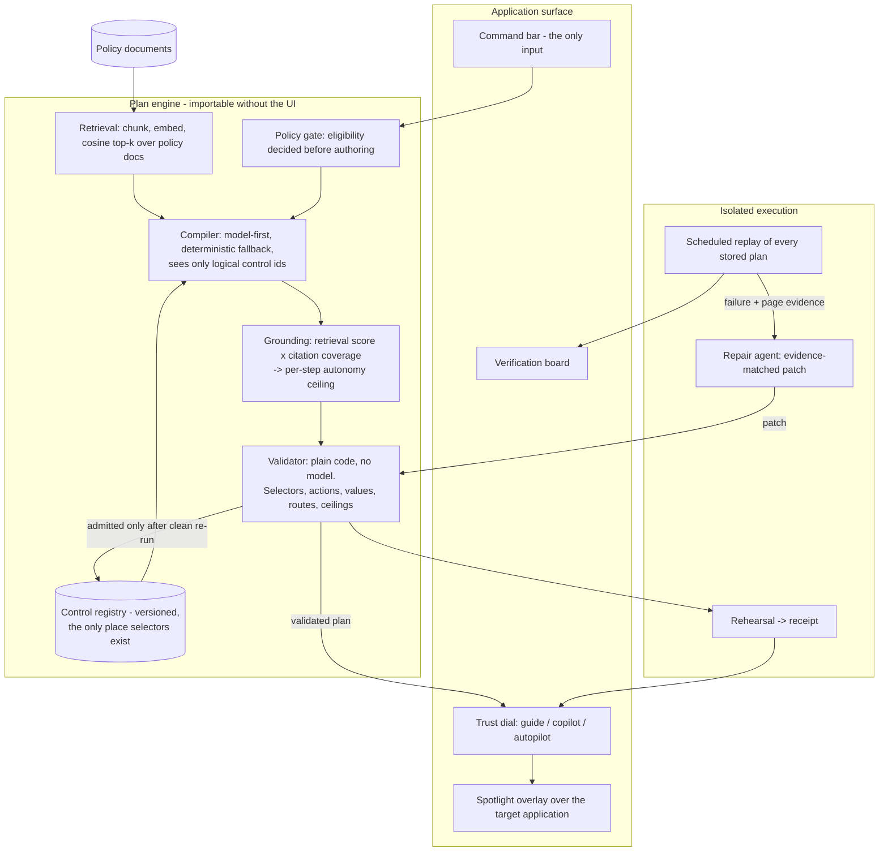
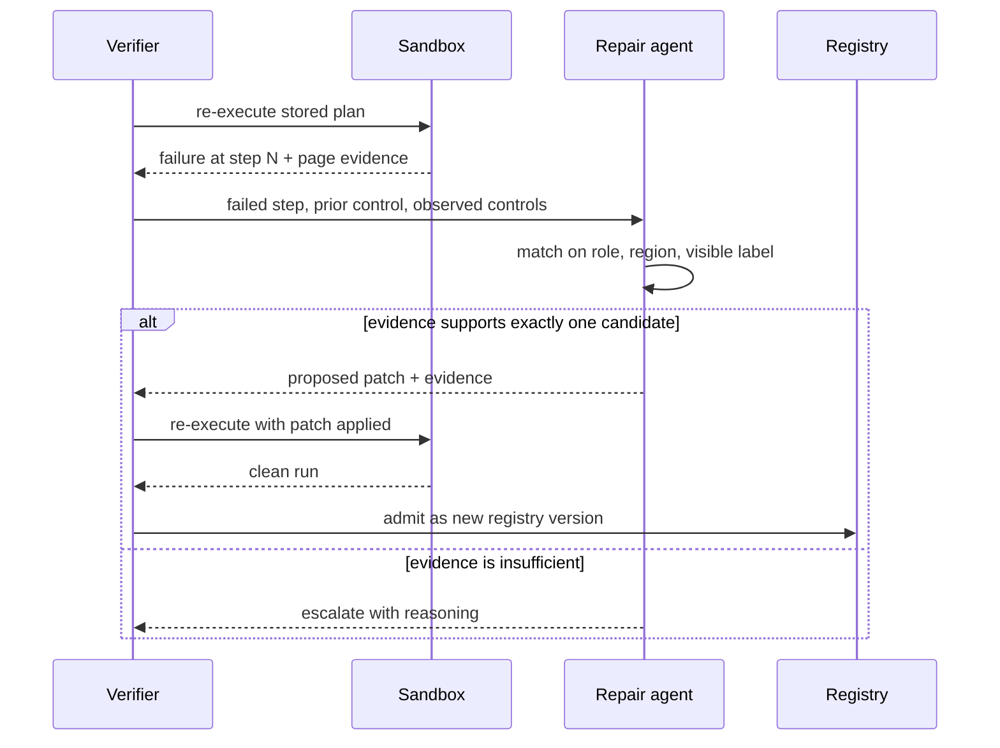

# Kerb

**An execution layer that sits on top of existing software and does the work inside it — at a level of autonomy you choose, with proof that it still works.**

---

## Abstract

Every organization that runs on complex internal software builds the same four artifacts, over and over, with four different teams and four different budgets: onboarding material that teaches an operator how to perform a task, support documentation that answers them when it goes wrong, automation that performs the task for them, and regression tests that assert the interface still behaves. These are treated as unrelated disciplines. They are not. Each one is a claim about the same underlying object — *an ordered, policy-justified sequence of interactions with a live interface* — expressed at a different level of trust and read by a different audience.

Kerb makes that object explicit and executable. It compiles a stated outcome ("issue a refund for claim #4821") into a **Guide Plan**: a validated, individually-cited sequence of steps written against a registry of approved interface controls. The plan is the single artifact. Rendered with the interface highlighted step by step it is a tutorial; executed step by step behind a confirmation it is a copilot; executed end to end after a sandbox rehearsal it is automation; replayed continuously against the running application it is a regression test.

The consequence is a property that documentation, runbooks, and recorded automations have never had: **Kerb knows whether its own guidance is still true.** Every plan is re-executed against the live interface on a schedule. When the interface drifts — a control renamed, a field relocated — the replay fails, a repair agent proposes a correction supported by observable evidence from the changed page, and the correction is admitted only after it passes validation and re-executes cleanly in an isolated sandbox. Guidance that would otherwise rot silently repairs itself and proves the repair before anyone depends on it.

The model in this system is deliberately weak. It proposes; it never decides. A registry bounds where it may act, a validator written in ordinary code bounds what it may do there, a computed grounding score bounds how autonomously any individual step may run, and a sandbox bounds where consequences land first. Remove the model entirely and the system still produces correct, conservative plans — that is the design, not a fallback.

---

## What Kerb does

Kerb attaches to an application whose interactive controls carry a stable attribute, and gives its operators one input: **state an outcome**.

**It compiles the outcome into a plan.** Relevant policy is retrieved from the organization's own documents and the plan is written to satisfy it. A refund of $612.50 acquires a reason-code step and a supervisor memo because policy requires them above $500; the same request for $180.00 does not. Each step carries the sentence justifying it and a citation to the source. The plan is derived from the rules, not from guessing at the screen.

**It refuses the work it cannot justify.** Eligibility is decided before a plan is authored, so a prohibited outcome — a refund against a disputed claim — produces a handoff naming the blocking rule and the steps already completed, never a fluent plan that happens to be wrong.

**It delivers that plan at the trust level you select.** One control moves between three positions, and every position is a projection of the identical plan object:

| Position | Behavior | Serves |
|---|---|---|
| **Guide** | Highlights each control in sequence with its justification and citation; the operator acts | Someone learning the task |
| **Copilot** | Performs each step on confirmation; steps with weak support stop and ask regardless of the setting | Someone who knows the task and wants speed |
| **Autopilot** | Rehearses the entire plan in an isolated sandbox, presents a verified receipt, then performs it live with input frozen | Someone who wants the outcome |

Autonomy is bounded per step, not per session. The effective level for any step is the lower of what the operator selected and what that step's evidence supports; a weakly-grounded step cannot be escalated by turning the dial up.

**It verifies itself continuously.** A background verifier re-executes every stored plan in a disposable sandbox and reports a live pass/fail board — the operational status of the organization's own guidance. Failures trigger the repair path described above.

---

## System architecture



### The artifact

Every component in the system produces, checks, or consumes one object:

```json
{
  "plan_id": "pln_4821_r1",
  "goal": "Issue a refund for claim #4821",
  "compiler": "deterministic",
  "registry_version": 1,
  "sources": [{"doc": "refund-policy.md", "chunk": 4, "score": 0.87}],
  "steps": [{
    "id": 5,
    "route": "claim",
    "selector": "claims.refund.reason_code",
    "action": "select",
    "value": "RC-07",
    "why": "Large refunds require a reason code; refunds issued to correct a processing error must use RC-07",
    "citation": {"doc": "refund-policy.md", "chunk": 4},
    "grounding": 0.87,
    "autonomy_ceiling": "autopilot"
  }]
}
```

Every mode renders the same object and displays the same `plan_id`, which is what makes "one engine, three behaviors" verifiable rather than asserted.

### The four bounds

The system's safety does not rest on model behavior:

1. **Registry.** The compiler is shown logical control ids and their permitted actions — never a selector. A hallucinated control is not a runtime hazard; it fails to resolve at validation and the plan is rejected.
2. **Validator.** Plain Python, no model in the path. It checks that each selector is registered, each action is permitted on that control, each value fits the control's type, each step's route is reachable from the previous step's route, and no step claims more autonomy than its evidence supports. Nothing renders or executes without passing.
3. **Grounding.** `retrieval_score x citation_coverage`, computed after authoring by code the compiler does not control. Above 0.75 a step may run unattended; between 0.45 and 0.75 it must be confirmed; below that it is escalated rather than performed. The model never scores its own work.
4. **Sandbox.** Live execution is never first contact. The plan runs to completion in a disposable browser session first, and the operator approves a receipt of what actually happened before anything touches the real interface.

### Repair loop



A repair that cannot be justified is never guessed. An unmatched failure escalates with its reasoning intact, because guidance that is confidently wrong is worse than guidance that is visibly broken.

---

## Running it

```bash
python3.11 -m venv .venv && .venv/bin/pip install -r requirements.txt && .venv/bin/playwright install chromium
```

```bash
cp .env.example .env
```

Kerb runs with no model endpoint configured: retrieval falls back to lexical scoring and the deterministic compiler authors plans. Setting `KERB_LLM_BASE_URL`, `KERB_LLM_API_KEY`, `KERB_LLM_MODEL`, and `KERB_EMBED_MODEL` to any OpenAI-compatible endpoint enables embedding-based retrieval and model-authored plans. No vendor SDK is imported anywhere in the codebase.

```bash
.venv/bin/reflex run --frontend-port 3100 --backend-port 8100
```

Then open `http://localhost:3100`, press the command bar, and state an outcome.

**Meridian**, the instrumented claims application bundled here, is the demonstration surface — a realistic back-office with twelve registered controls. Integrating a different application means adding an attribute to its controls and describing them in the registry; the engine imports nothing from Meridian.

---

## Layout

```
kerb/
  engine/       llm, retrieval, compiler, registry, validator, sandbox executor, store
  meridian/     the instrumented demonstration application
  state.py      one state object: the dial, the plan, the live executor
  kerb.py       shell - dial, command bar, plan rail, verification drawer
sentinel/       scheduled replay and the repair agent
docs/           architecture, specification, decisions, roadmap, demo
scripts/        sandbox replay entrypoint, demo reset
```

## Documentation

- [docs/ARCHITECTURE.md](docs/ARCHITECTURE.md) — how the system is built and why
- [docs/SPEC.md](docs/SPEC.md) — contracts, schemas, and enforced rules
- [docs/DECISIONS.md](docs/DECISIONS.md) — decisions made under constraint, and their reasoning
- [docs/ROADMAP.md](docs/ROADMAP.md) — build sequence
