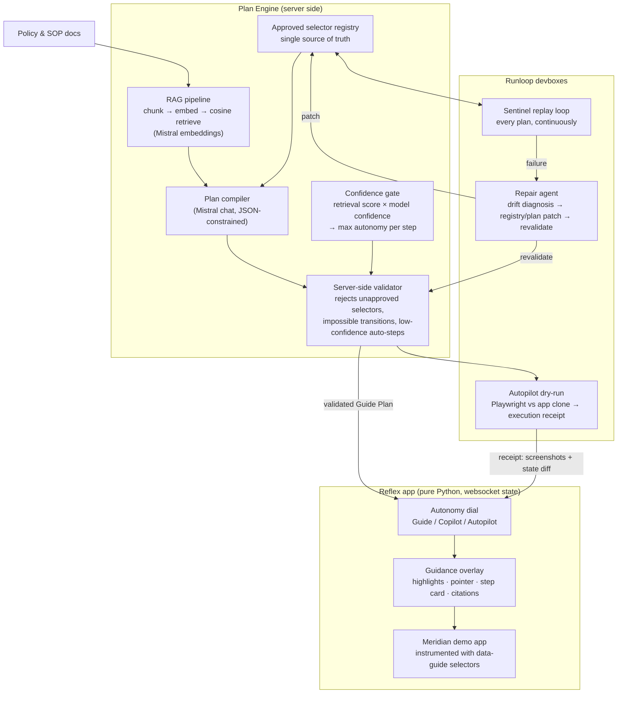

# Kerberos Architecture

One engine, four projections. Everything below exists to make a single artifact — the **Guide Plan** — compilable, safe, executable, and self-maintaining.

## System overview



## The Guide Plan (the one artifact)

```json
{
  "goal": "Issue a refund for claim #4821",
  "sources": [{"doc": "refund-policy.md", "chunk": 14, "score": 0.91}],
  "steps": [
    {
      "id": 3,
      "selector": "claims.refund.reason-code",
      "action": "select",
      "value": "RC-07",
      "why": "Refunds over $500 require a reason code (policy §4.2)",
      "retrieval_confidence": 0.91,
      "model_confidence": 0.88,
      "max_autonomy": "autopilot"
    }
  ]
}
```

Every field matters to a different mode: Guide renders `why` + citations; Copilot executes `action` with per-step confirmation; Autopilot needs `max_autonomy` clearance on **every** step; Sentinel replays `steps` verbatim as a regression test.

## Component notes

### 1. Selector registry (`kerberos/engine/registry.py`)
Canonical map: logical name → CSS selector (`[data-guide="claims.refund.reason-code"]`) + allowed actions + human label. The planner is prompted **only with logical names**, never raw CSS — it cannot invent a selector that isn't registered. The registry is versioned; Sentinel patches create new versions with a diff trail.

### 2. RAG pipeline (`kerberos/engine/rag.py`)
`chunkMarkdown → Mistral embeddings → in-memory vector store → cosine top-k`. Each retrieval carries its score forward into the plan; a plan step citing a chunk below threshold is demoted (Guide-only) or triggers escalation ("I can't do this safely — here's a human handoff").

### 3. Plan compiler (`kerberos/engine/planner.py`)
Mistral chat call with JSON-constrained output: goal + retrieved chunks + registry (logical names, labels, allowed actions) → Guide Plan. Compilation is stateless and cacheable; the same goal recompiles only when docs or registry change.

### 4. Validator (`kerberos/engine/validator.py`)
Pure-Python server-side gate, no LLM. Rejects: unknown selectors, actions not allowed for that selector, value types that don't match the control, and any step marked for auto-execution whose combined confidence is below the autopilot threshold. **Nothing renders or executes without passing this.** This is the safety story in one file.

### 5. Autonomy dial (Reflex state)
`mode: guide | copilot | autopilot` is a single state var. The same validated plan streams over the websocket; the frontend projection changes, the plan never does. Effective autonomy per step = `min(user_mode, step.max_autonomy)` — the user can dial up, but a low-confidence step still stops and asks.

### 6. Runloop execution
- **Dry-run**: Autopilot first launches the app in a devbox, runs the plan with Playwright, captures per-step screenshots + final state diff → execution receipt shown to the user before live replay.
- **Sentinel**: a loop that replays every stored plan in fresh devboxes on a schedule (or on demand, for the demo). Failure output (failed step, DOM snapshot) feeds the repair agent.
- **Repair agent**: Mistral call with the failed step, old selector entry, and the new DOM snapshot → proposed registry patch → validator + re-replay in a fresh devbox → patch merges only on green.

### 7. Reflex specifics
- `custom_attrs={"data-guide": "..."}` instruments Meridian components; the registry is generated from the same Python constants, so app and registry cannot drift apart *silently* — and when we sabotage them on purpose for the demo, Sentinel is what catches it.
- Highlight overlay = absolutely-positioned component driven by server state; step advancement streams over the existing websocket, no polling, no injected JS.

## Sequence: one question, three projections

```mermaid
sequenceDiagram
    participant U as User
    participant R as Reflex state
    participant E as Plan engine
    participant D as Runloop devbox

    U->>R: "Issue a refund for claim #4821"
    R->>E: compile(goal)
    E->>E: RAG retrieve → plan → validate → confidence-gate
    E-->>R: validated Guide Plan (streamed)
    alt Guide mode
        R-->>U: highlight step 1 + why + citation; advance on user action
    else Copilot mode
        R-->>U: propose step 1; on confirm, execute; repeat
    else Autopilot mode
        R->>D: dry-run full plan (Playwright)
        D-->>R: execution receipt
        R-->>U: show receipt; on confirm, replay live with reasoning ticker
    end
```

## Safety model, in one paragraph

The LLM's authority ends at proposing logical steps. The registry bounds *where* it can act, the validator bounds *what* it can do there, confidence bounds *how autonomously*, and Runloop bounds *where side effects happen first*. Every layer is inspectable in the demo, which is exactly what makes technical judges trust the autonomy.
